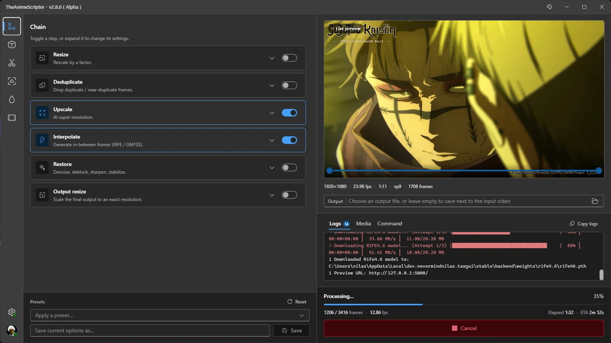

<div align="center">

# 🎬 The Anime Scripter

**Free, open-source AI video enhancement for anime and beyond.**<br>
Upscale, interpolate, restore and dedup in a single GPU pass from the CLI, a Windows desktop app, or directly inside After Effects.

[](https://github.com/NevermindNilas/TheAnimeScripter/releases)
[](https://github.com/NevermindNilas/TheAnimeScripter/releases)
[](https://discord.gg/hwGHXga8ck)
[](LICENSE)
[](https://github.com/NevermindNilas/TheAnimeScripter/stargazers)

[](https://github.com/NevermindNilas/TheAnimeScripter/releases/latest)
[](https://tas.nevermindnilas.dev)
[](https://youtu.be/V7ryKMezqeQ)


*720p master → Adore 2x. [More demos](https://tas.nevermindnilas.dev)*

</div>

## ✨ Why TAS

- **Anime-first models.** Line-art-tuned upscalers (ShuffleCUGAN, Adore, Fallin, AniScale 2, Cyte), RIFE up to 4.26, anime depth (Limbo) and anime segmentation, plus general-purpose models for live action and games.
- **One pass, in memory.** Decode → dedup → restore → interpolate ↔ upscale → encode runs as one pipeline with no intermediate files. NVDEC decoding, TensorRT engines and CUDA graphs keep the GPU busy.
- **Built for animation.** `--smooth_dedup` detects frames held on twos and threes and interpolates across them while keeping the original length and audio. `--scenechange` holds the frame at hard cuts so nothing morphs between shots. `--mask` keeps HUDs and hardsubs from warping.
- **Runs on most GPUs.** CUDA, TensorRT, DirectML, OpenVINO, NCNN/Vulkan, Apple Silicon (MPS) and AMD ROCm on Linux.
- **Works where you edit.** A native After Effects panel, a standalone Windows app and a scriptable CLI with presets, batch input and YouTube URLs.

## 🧰 What it does

| Feature | Flag | Models | Backends |
|---|---|---|---|
| **Upscale** | `--upscale` | ShuffleCUGAN, Adore, Fallin Soft/Strong, Cyte, SPAN, Open-Proteus, AniScale 2, RTMoSR, Saryn, Gauss, SmoSR, FigSR, AnimeSR, ArtCNN, NVIDIA Maxine VSR, your own Spandrel/ONNX model | CUDA · TRT · DML · OpenVINO · NCNN · MPS · ROCm |
| **Interpolate** | `--interpolate` | RIFE 4.6 – 4.26 (lite / heavy), RIFE Elexor, DistilDRBA, GMFSS Fortuna, NVIDIA Maxine Frame Generation | CUDA · TRT · DML · OpenVINO · NCNN · MPS · ROCm |
| **Restore** (chainable) | `--restore` | Anime1080Fixer, SCUNet, NAFNet, DPIR, DeJPEG, DeH264, GaterV3, HurrDeblur, DeHalo, deepDeband, FastLineDarken, LineThinner, AutoCAS, Maxine denoise/deblur | CUDA · TRT · DML · OpenVINO · MPS · ROCm |
| **Dedup** | `--dedup` / `--smooth_dedup` | SSIM, MSE, VMAF, FlowNetS | CPU · CUDA · ROCm |
| **Depth maps** | `--depth` | Depth Anything V2 & 3, Video Depth Anything, Limbo V1/V2 (anime), DA3 streaming | CUDA · TRT · DML · OpenVINO · MPS · ROCm |
| **Segmentation** | `--segment` | Anime Segmentation, BiRefNet (anime) | CUDA · TRT · DML · ROCm |
| **Object detection** | `--obj_detect` | YOLOv9 (MIT) S / M / L | TRT · DML · OpenVINO |
| **Scene detection** | `--autoclip` / `--scenechange` | PySceneDetect, TransNetV2, MaxxViT, SSIM/MSE | CPU · CUDA · TRT · DML · ROCm |
| **Stabilize** | `--stabilize` | Classic (feature tracking), DUT (deep mesh warp) | CPU · CUDA · ROCm |
| **Motion blur** | `--moblur` | RIFE-driven shutter simulation | CUDA · TRT · DML · MPS · ROCm |

Output goes through FFmpeg or TAS's in-process [Nelux](https://github.com/NevermindNilas/Nelux) encoders: x264/x265/AV1/VP9, NVENC, QSV, AMF, ProRes (with alpha), lossless, GIF and PNG/JPEG sequences.

**[PARAMETERS.MD](PARAMETERS.MD)** has every flag, every model with its backends, and recommendations by content type.

## 📦 Get TAS

| Edition | Platform | What it is |
|---|---|---|
| **[TAS-Standalone](https://github.com/NevermindNilas/TheAnimeScripter/releases/latest)** | Windows | Desktop app with its own backend: no Python, no terminal. Toggle steps into a chain, watch the live preview and save presets. |
| **[TAS-AdobeEdition](https://github.com/NevermindNilas/TheAnimeScripter/releases/latest)** | Windows, macOS | After Effects 2022+ panel. Follow the [installation guide](https://nevermindnilas.github.io/zxp-installation/) or the [video tutorial](https://youtu.be/JAdZ3z-os_A). |
| **[CLI](https://github.com/NevermindNilas/TheAnimeScripter/releases/latest)** | Windows, macOS (Apple Silicon), Linux (source) | Every option, scriptable. [Nightly builds](https://github.com/NevermindNilas/TAS-Nightly/releases) carry the newest features. |

<table>
<tr>
<td align="center"><br><sub>TAS-Standalone</sub></td>
<td align="center"><br><sub>After Effects panel</sub></td>
</tr>
</table>

Models download on first use, so the first run with a new model takes longer.

### Which backend fits your GPU

| Hardware | Use |
|---|---|
| NVIDIA RTX 20 – 50 / GTX 16 | CUDA (default) or `-tensorrt` for maximum speed |
| NVIDIA GTX 10 and older | `-directml` |
| AMD / Intel on Windows | `-directml`, or `-openvino` on Intel |
| AMD on Linux | `-rocm` (experimental) |
| Apple Silicon (M1+) | `-mps` |
| Anything with Vulkan | `-ncnn` (RIFE, ShuffleCUGAN, SPAN) |

NVIDIA Maxine methods need an RTX card (Frame Generation needs an RTX 40 or 50).

## 🚀 Quick start

Windows CLI one-liner. It installs into a `TheAnimeScripter` folder in the current directory and asks whether to add that folder to PATH:

```powershell
iwr -useb https://tas.nevermindnilas.dev/install.ps1 | iex
```

Then run it. Without the installer, use `python main.py` in place of `tas`:

```sh
# 2x upscale + 2x interpolation, anime defaults
tas --input episode.mp4 --upscale --interpolate

# Picking a method enables its step: TensorRT upscale + RIFE 4.25, scaled to 4K
tas --input episode.mp4 --upscale_method shufflecugan-tensorrt --interpolate_method rife4.25-tensorrt --output_scale 3840x2160

# Anime on twos → smooth motion, same length, cuts left untouched
tas --input episode.mp4 --smooth_dedup --scenechange

# Chain restorers, encode 10-bit
tas --input old_show.mkv --restore_method deh264_real anime1080fixer --encode_method x265_10bit

# Temporally stable depth map
tas --input clip.mp4 --depth_method video_small_v2
```

`--input` also takes folders, `;`-separated lists, `.txt` batch files and URLs. Run `tas --list_presets` and `tas --list_methods` to explore, or `tas -h` for every option.

<details>
<summary><b>Run from source</b></summary>

TAS targets **Python 3.14**. Install the base requirements plus the profile for your platform:

```sh
python -m pip install -r requirements.txt -r extra-requirements-windows.txt
python main.py -h
```

| Profile | For |
|---|---|
| `extra-requirements-windows.txt` / `-linux.txt` | NVIDIA: CUDA, TensorRT, Maxine, plus everything in lite |
| `extra-requirements-windows-lite.txt` / `-linux-lite.txt` | No CUDA: DirectML/OpenVINO, NCNN, CPU |
| `extra-requirements-linux-rocm.txt` | AMD ROCm (experimental) |
| `extra-requirements-macos.txt` | Apple Silicon (MPS) |

Or let TAS install a profile for you: `python main.py --download_requirements` (it asks which to use), or pass one by name, e.g. `--download_requirements linux-rocm`.

On macOS TAS uses Homebrew's FFmpeg and runs `brew install ffmpeg` on first launch if it is missing. FFmpeg is GPL, so TAS does not ship it. [Homebrew](https://brew.sh) itself must already be installed.

Portable builds: see [BUILD.md](BUILD.md).

</details>

## 🙏 Credits

TAS builds on the work of many model authors and open-source projects. Third-party license notices are in [THIRD_PARTY_NOTICES.md](THIRD_PARTY_NOTICES.md).

<details>
<summary><b>Models & research</b></summary>

| Contributor | Contribution |
|---|---|
| [hzwer](https://github.com/hzwer) | [RIFE](https://github.com/hzwer/Practical-RIFE) interpolation |
| [Elexor](https://github.com/elexor) | Modified RIFE (RIFE Elexor) |
| [routineLife1](https://github.com/routineLife1) | [DistilDRBA](https://github.com/routineLife1/DistilDRBA) |
| [98mxr](https://github.com/98mxr) / [HolyWu](https://github.com/HolyWu) | GMFSS Fortuna, [vs-gmfss_fortuna](https://github.com/HolyWu/vs-gmfss_fortuna), [vs-animesr](https://github.com/HolyWu/vs-animesr) |
| [TencentARC](https://github.com/TencentARC) | [AnimeSR](https://github.com/TencentARC/AnimeSR) |
| [styler00dollar (SUDO)](https://github.com/styler00dollar) | ShuffleCUGAN & ONNX models ([VSGAN-tensorrt-docker](https://github.com/styler00dollar/VSGAN-tensorrt-docker)) |
| [renarchi](https://github.com/renarchi) | Adore, Fallin Soft & Strong |
| [Sirosky](https://github.com/Sirosky) | Open-Proteus, AniScale 2 ([Upscale-Hub](https://github.com/Sirosky/Upscale-Hub)) |
| [umzi](https://github.com/umzi2) | RTMoSR, GaterV3 |
| [Kim2091](https://github.com/Kim2091) | [DIS](https://github.com/Kim2091/DIS) architecture (Gauss) |
| [Artoriuz](https://github.com/Artoriuz) | [ArtCNN](https://github.com/Artoriuz/ArtCNN) |
| [Phhofm](https://github.com/Phhofm/models) | DeJPEG & DeH264 restoration |
| [Zarxrax](https://github.com/Zarxrax) | Anime1080Fixer, [BiRefNet-Real_Anime](https://huggingface.co/Zarxrax/BiRefNet-Real_Anime) |
| [ZhengPeng7](https://github.com/ZhengPeng7) | [BiRefNet](https://github.com/ZhengPeng7/BiRefNet) architecture |
| [SkyTNT](https://github.com/SkyTNT) | [Anime segmentation](https://github.com/SkyTNT/anime-segmentation) |
| [Raymond Zhou et al.](https://github.com/RaymondLZhou) | [deepDeband](https://github.com/RaymondLZhou/deepDeband) |
| [DepthAnything](https://github.com/DepthAnything) / ByteDance | [Depth Anything V2](https://github.com/DepthAnything/Depth-Anything-V2), [Video Depth Anything](https://github.com/DepthAnything/Video-Depth-Anything), Depth Anything 3 |
| [Annbless](https://github.com/Annbless) | [DUT](https://github.com/Annbless/DUTCode) video stabilization |
| [soCzech](https://github.com/soCzech) | [TransNetV2](https://github.com/soCzech/TransNetV2) shot detection |
| [MultimediaTechLab](https://github.com/MultimediaTechLab) / [ibaiGorordo](https://github.com/ibaiGorordo) | [YOLOv9 (MIT)](https://github.com/MultimediaTechLab/YOLO), [ONNX port](https://github.com/ibaiGorordo/ONNX-YOLOv9-MIT-Object-Detection) |
| [AMD GPUOpen](https://github.com/GPUOpen-Effects) | [FidelityFX CAS](https://github.com/GPUOpen-Effects/FidelityFX-CAS) (AutoCAS) |
| [NVIDIA](https://developer.nvidia.com/maxine) | Maxine Video Effects SDK (VSR, denoise/deblur, Frame Generation) via `nvidia-vfx` |

</details>

<details>
<summary><b>Frameworks & tools</b></summary>

| Project | Used for |
|---|---|
| [FFmpeg](https://github.com/FFmpeg/FFmpeg) | Encoding, muxing, audio |
| [spandrel](https://github.com/chaiNNer-org/spandrel) (chaiNNer-org; vendored [TNTwise](https://github.com/TNTwise) fork) | Model architectures, custom models |
| [rife-ncnn-vulkan](https://github.com/nihui/rife-ncnn-vulkan) (nihui), [TNTwise fork](https://github.com/TNTwise/rife-ncnn-vulkan), [Python wrapper](https://github.com/media2x/rife-ncnn-vulkan-python) (media2x) | NCNN/Vulkan RIFE |
| [yt-dlp](https://github.com/yt-dlp/yt-dlp) | URL input |
| [PySceneDetect](https://github.com/Breakthrough/PySceneDetect) | Scene detection |
| [bolt-cep](https://github.com/hyperbrew/bolt-cep) (Hyperbrew) | After Effects panel framework |

</details>

**Collaborators:** [Trentonom0r3](https://github.com/Trentonom0r3) (TAS Adobe Edition) · [Adegerard](https://github.com/adegerard) (architecture & optimization suggestions)

> Missing someone? Email [nilascontact@gmail.com](mailto:nilascontact@gmail.com) or open an issue.

<div align="center">

<a href="https://github.com/NevermindNilas/TheAnimeScripter/graphs/contributors">
  
</a>

[](https://star-history.dera.page/#NevermindNilas/TheAnimeScripter&Date)

Licensed under [AGPL-3.0](LICENSE). Some model weights carry their own terms; see [THIRD_PARTY_NOTICES.md](THIRD_PARTY_NOTICES.md).

</div>
